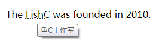
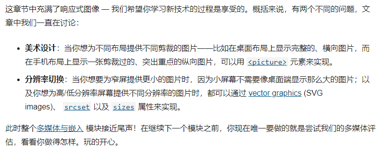

# Web开发学习

## HTML（超文本标记语言）

> 决定网页的结构

> [HTML参考手册]:"https://developer.mozilla.org/zh-CN/docs/Web/HTML/Reference"

> [HTML学习链接]:"https://developer.mozilla.org/zh-CN/docs/learn/HTML"

## 一、HTML介绍

> https://developer.mozilla.org/zh-CN/docs/Learn/HTML/Introduction_to_HTML

一个HTML元素包含哪些部分：

- 元素：单一元素、元素的嵌套，块级元素和内联元素，空元素
- 标签：开始标签和结束标签
- 内容

### 1.1 head标签里有什么：标题title、元数据meta、链接link、样式style、JS链接script、文档打开方式base

> 学习 HTML <head> 标签的概念、用途、基本组成，以及它对 HTML 文档所起的作用

#### 1.1.1 head元素的作用

- 包含了网页的一些信息例如页面的标题
- 页面的样式
- 元数据：作者信息，文档描述等

h1添加文档body元素内容的标题，title添加整个HTML文档的标题

<meta>元素的用途

- 规定文档字符编码

  - `utf-8` 是一个通用的字符集，它包含了任何人类语言中的大部分的字符。 意味着该 web 页面可以显示任意的语言；所以对于你的每一个页面都使用这个设置会是一个好主意！比如说，你的页面可以很好的处理中文和藏文

  - `GBK` （中国大陆国标字符集）

**应该为页面手动设置编码为`utf-8`，来避免在其他浏览器中可能出现的潜在问题**

#### 1.1.2 添加作者和描述

<meta name="xxx" content="xxx">

- `name` 指定了meta 元素的类型； 说明该元素包含了什么类型的信息

- `content` 指定了实际的元数据内容

#### 1.1.3 为自己的站点添加自定义图标

<link href="">

#### 1.1.4 在HTML中应用CSS和JavaScript

- <link>元素链接CSS样式

  - 位置：经常位于文档的头部
  - <link rel="stylesheet" href="CSS文件路径">

- <script>元素链接JavaScript文件

  - 位置：经常位于文档的尾部，</body>之前

  - <script src="JS文件路径"></script>

### 1.2 HTML文字处理基础

> 学习如何用标记(段落、标题、列表、强调、引用)来建立基础文本页面的文本结构和文本内容

#### 1.2.1 标题和段落

每个页面最好只是使用一次<h1>标签

#### 1.2.2 三种不同类型的列表

- 无序列表
  - ul+li

- 有序列表
  - ol+li

- 嵌入式列表

#### 1.2.3 重点强调

- 斜体：em标签
- 加粗：strong标签

如果没有更合适的元素，那么使用 `<b>`、`<i>` 或 `<u>` 来表达传统上的粗体、斜体或下划线表达的意思是合适的


### 1.3 建立超链接

> 学习如何实现一个有效地把多个文件链接在一起的超文本链接

- **标签a有哪些属性**


#### 1.3.1 链接的解析

标签：<a>

属性

- href：超链接的地址
- title：超链接的补充信息，鼠标悬停显示

#### 1.3.2 块级链接

- 把图像这种块级元素放到<a>标签里，图像就转换为链接

#### 1.3.3 路径的定位和查找

- 指向当前目录：只需文件名
- 指向子目录：子文件夹名/文件名
- 指向上级目录：../xxx/xxx/

#### 1.3.4 链接到文档的特定部分（文档片段）

给链接的元素分配一个id属性。

```
<h1 id="xxx">
<a href="文件名.html#xxx"></a>
```

#### 1.3.5 邮箱链接

<a href="mailto:邮箱">

### 1.4 高阶文字排版

> 学习一些不常见的 HTML 元素标记来使用高级语义功能

#### 1.4.1 描述列表(describe list)

> 这种列表的目的是标记一组项目及其相关描述，例如术语和定义，或者是问题和答案等

由外到内标签

```
<dl>
	<dt></dt>
		<dd></dd>
</dl>
```

#### 1.4.2 引用

> 标签之间的所有文本都会从常规文本中分离出来，通常浏览器会在左右两侧增加缩进。

- 块引用<blockquote>

块引用拥有自己的空间

- 行内引用<q>

引用简短的内容，会在引用的内容两端加上引号

cite属性宁内容不会被浏览器显示，如果要显示，最好加上<a>或者使用CSS和JS样式

#### 1.4.3 缩略语

```
<abbr title="鱼C工作室">FishC</abbr>
```



#### 1.4.4 上下标

```
<sup></sup>
<sub></sub>
```

### 1.5 文档与网站架构

> 会用语义标签来构建文档，会搭建简单的网站结构

#### 1.5.1 文档的基本组成部分

- 页眉

  ```
  <header>
  ```

- 导航栏

  ```
  <nav>
  ```

- 主内容

  ```
  <main>
  ```

- 侧边栏

  ```
  <aside>
  ```

- 页脚

  ```
  <footer>
  ```

#### 1.5.2 HTML布局元素细节

- `<mian>`存放每个页面独有的内容。每个页面上只能用一次 `<main>`，且直接位于`<body>`中。最好不要把它嵌套进其它元素。
- `<article>`包围的内容即一篇文章，与页面其它部分无关（比如一篇博文）。
- `<section>`与`<article>` 类似，但 `<section>` 更适用于组织页面使其按功能（比如迷你地图、一组文章标题和摘要）分块。一般的最佳用法是：以标题作为开头；也可以把一篇 `<article>` 分成若干部分并分别置于不同的 `<section>` 中，也可以把一个区段 `<section>` 分成若干部分并分别置于不同的 `<article>` 中，取决于上下文。
- `<aside>`包含一些间接信息（术语条目、作者简介、相关链接，等等）。
- `<header>`是简介形式的内容。如果它是`<body>`的子元素，那么就是网站的全局页眉。如果它是`<article>`或`<section>`的子元素，那么它就是这些部分特有的页眉。
- `<nav>`包含页面主导航功能。其中不应包含二级链接等内容。
- `<footer>`包含了页面的页脚部分。

#### 1.5.3 无语义元素

> 出现的原因：有些需要包装的文档只是文档中的一部分需要用到CSS和JS的样式，于是HTML提供了`<div>`和`<span>`元素和`<class>`配合的方法

- `<sapn>`标签：用于修改局部的样式很方便，但是其本身是没有特定的样式的，只有在设置以后才能有视觉效果

- `<div>`标签：将文档的内容分隔开，经常和CSS样式一起使用

#### 1.5.4 换行与水平分割线

```
<br>
<hr>
```

##### 1.5.5 规划一个简单的的网站

- 通用内容
  - 页眉：标题和Logo
  - 页脚：联系方式和版权声明
  - 术语、状态
  - 站点语言选择
  - 无障碍访问策略
- 为页面绘制草图，记录每一块的作用

- 对于期望添加进站点的内容进行头脑风暴，直接罗列出来
- 试着对这些内容进行分组

### 1.6 信件标记

#### 1.6.1 为文档设置主语言是在html标签里

```
<html lang="zh-CN">
```

#### 1.6.2 链接CSS样式

```
<link href="路径" rel="stylesheet">
```

#### 1.6.3 链接js样式

```
<script src="路径"></script>
```

#### 1.6.4 给自己的站点添加图标
```
<link rel="icon" href="图片地址" type="image/x-icon">
```

#### 1.6.5 描述列表的使用

```
<dl>
	<dt></dt>
		<dd></dd>
</dl>
```

#### 1.6.6 有序列表和无序列表的使用

```
<addresss>标签的使用
```

### 1.7 构建丰富的网页结构

**站点的架构设计**

#### 1.7.1 页眉的设计：大标题、站点的logo、导航条

```
<header>
	<h1></h1>
	<nav>
		<ul>
			<li></li>
			<li></li>
		</ul>
	</nav>
</header>
```

#### 1.7.2 文档的主要内容区域：欢迎信息、缩略图

```
<main>
	<article>
		<h2></h2>
		<p></p>
	</article>
	<aside>
		<h2></h2>
		<a href=""></a>
		<a href=""></a>
	</aside>
</main>
```

#### 1.7.3 页脚的设计：版权信息和鸣谢

```
<footer>
	<h2></h2>
	<p></p>
</footer>
```

## 二、多媒体与嵌入

### 2.1 HTML中的图片

> 学习如何在 HTML 页面插入简单的图片，为图片添加简单的说明，以及 CSS 背景图片与 HTML 图片的关系。


#### 2.1.1 备选文本：alt属性

- 1.对图片的描述，当浏览器不能显示图片（会由于各中原因造成）时就会显示描述的文字

- 2.文字的内容写什么？
  - 如果图片只是背景的话可以直接让属性值为空
  - 如果是重要内容的话需要增加图片的关键信息

#### 2.1.2 指定图片的宽度和高度：width和height属性

```

```

- 1.应该在把图片放入你的网页之前就让图片的尺寸保持正确的宽高比
- 2.应该用CSS样式去修改图片的尺寸

#### 2.1.3 图片标题：titile属性，鼠标悬停显示

#### 2.1.4 为图片搭配说明文字来解释图片

- 这里描述图片的方法和前面的**`alt`**属性描述图片是不同的，**`alt**`**的内容只有在图片无法显示才会显示；这种方法能让图片和图片描述对应起来

```
<figure>
	
	<figcaption> 描述 </figcaption>
</figure>
```

#### 2.1.5 CSS背景图片属性：background-imag

> 如果图像对您的内容里有意义，则应使用HTML图像。 如果图像纯粹是装饰，则应使用CSS背景图片

### 2.2 视频和音频内容

> 学习如何在一个网页中嵌入音频和视频，以及如何为视频添加字幕。

在HTML标准提出之后才能进行

#### 2.2.1 video元素

```
<video src="路径" controls>
	<p></p>//后备内容
</video>
```

#### 2.2.2 使用多个播放源提升兼容性

```
<video>
	<source src="" type="video/mp4">
	<source src="" type="video/webm">
</video>
```

#### 2.2.3 其他video属性

- 循环播放 loop
- 静音播放 muted
- 自动播放 autoplay
- 视频框宽度 width
- 视频框高度 height
- 视频封面（预览） poster
- 视频缓冲 preload

#### 2.2.4 audio标签

audio的使用和video的使用很像似

### 2.3 嵌入其他内容

> 要了解如何使用object、embed、iframe在网页中嵌入部件，例如Flash电影或其他网页

iframe元素的作用是让第三方的（其他地方）网页的内容直接嵌入到自己的网站页面里

使用sandbox属性提高安全性

### 2.4 自适应式图片

分辨率的切换

1.图片尺寸不同，像素不同

2.图片尺寸相同，像素不同

图片自适应怎么弄

根据屏幕大小的改变自动切换设置显示的图片





## ⏰一、国庆schedule⌚

- **1.不能睡懒觉，作息可以比平时晚起床半小时；晚上千万不能熬夜刷手机，12点之前必须睡着**

- **2.这七天不能浪费了，必须保持高效的学习model（其中出去和家人朋友玩一下也是可以的，但是时间不能超过1天）**

- **3.给自己定一个目标，在这七天内完成什么学习任务**

- **4.国庆假期结束的时候线上会议sharing自己这几天的学习成果**

### 🤔二、奖惩措施和互相监督的规则😮

- **1.上面的这几点如果有任意一条违背了，就罚款500（其实如果做不到，内心的愧疚和焦虑才是最可怕的）**

- **2.自己制定的七天学习计划一定要有针对性和目的性，在这七天的时间里达到一个自己想要的效果，有可见的输出**

### 🌈三、我的国庆学习计划☃

- **1.完成《就算》和《8月27日xx段留言》的demo**

- **2.完成前端入门的学习**


- **3.毕业论文课题方向汇报，收假后和邹博以及导师讨论自己的想法，然后确定毕业论文的方向**


## CSS

> 决定网页的表现与展示效果，给网页“美颜”


## JavaScript

> 决定网页的动态功能，让静态网页动起来

